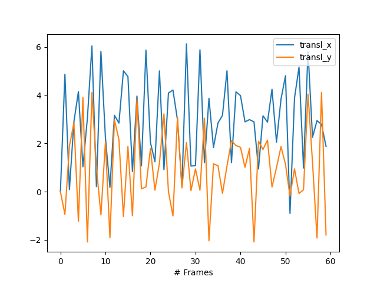
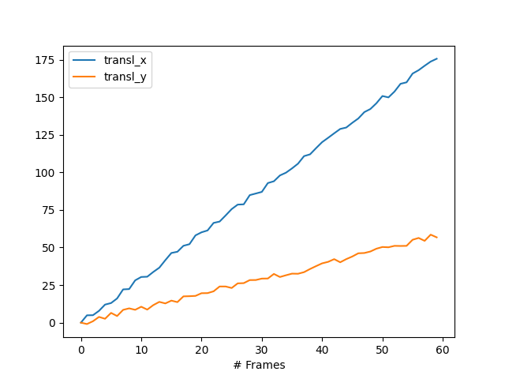

<p align="center" width="100%">
    
</p>

**Drift-correction** is an application designed to easily realign frames in image stacks, using [Napari](https://napari.org/) as the viewer and the [DIPlib](https://diplib.org/) library for shift calculation.

Supported input formats include ``.tif``, .``dm3``/``.dm4``, ``.npy`` and any other format compatible with Napari.

Additional files showing the frame-by-frame and cumulative shifts can be saved in the same directory as the input file.

The realigned stack can be saved via the Napari **Files** tab.


<p align="center" width="100%">
    
</p>
<p align="center">
    <em>Illustration of drift correction on a synthetic test case — the uncorrected stack is shown in gray, and the corrected (cropped) version in green.</em>
</p>

<p align="center" width="100%">
    
    
</p>
<p align="center">
    <em>The corresponding frame-by-frame (left) and cumulative (right) shifts.</em>
</p>

## Installation and launching

```bash
pip install git+https://github.com/CEA-MetroCarac/drift_correction.git
drift-correction
```

## Scripting mode

Drift correction can also be performed via Python scripting (without the Napari GUI), by passing a 3D array ``arr`` to the function as shown in:

```bash
from drift_correction import process

arr_aligned, shifts, shifts_cumul = process(arr,
                                            ind_min=0, ind_max=9999, pbar_update=None,
                                            dirname=None, fname_aligned=None, working_dir=None)
```

See [example_analytical.py](./examples/example_analytical.py) for a demonstration and refer to the function docstring [process()](./drift_correction/drift_correction.py#L59-L95) for details on the arguments.

## Acknowledgements

This work, carried out at **CEA-PFNC** (Platform for Nanocharacterisation), was supported by the “Recherche Technologique de Base” program of the French National Research Agency (ANR).